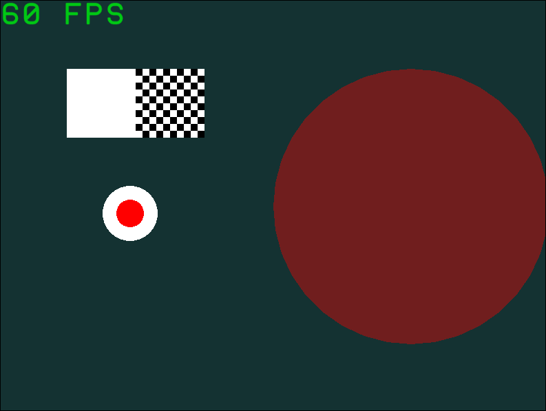
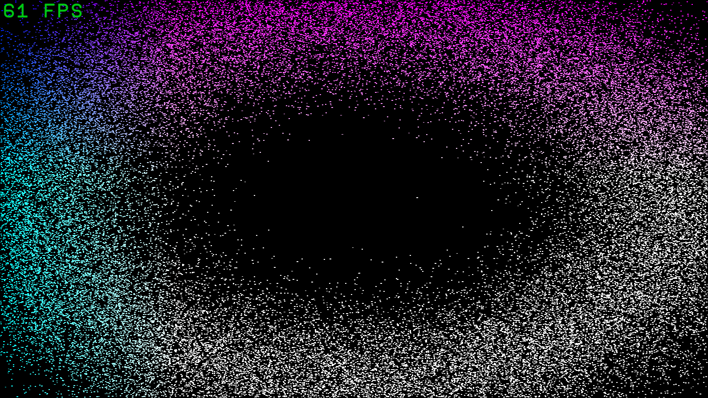
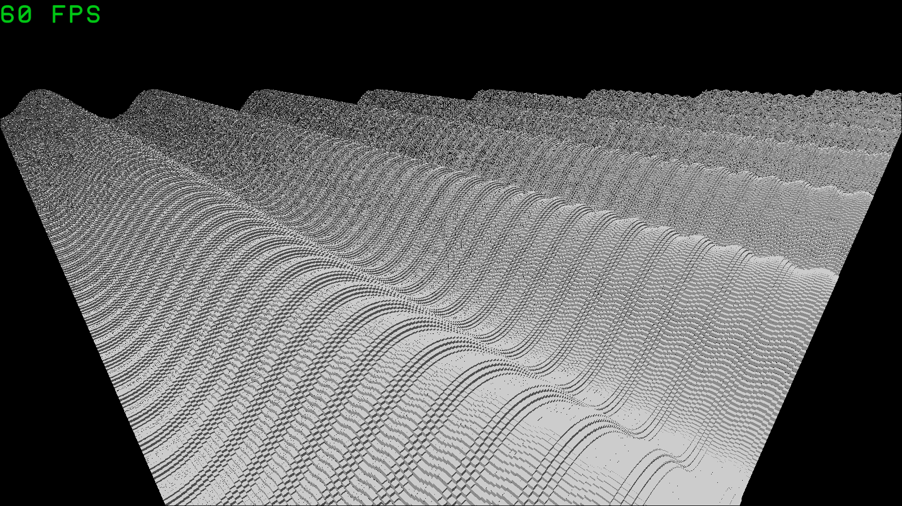

# RayGPU

[](https://github.com/manuel5975p/raygpu/actions/workflows/cmake-multi-platform.yml)


RayGPU is a fast and simple Graphics Library written in C99, inspired by and based on [raylib](https://github.com/raysan5/raylib/). It targets Vulkan 1.1+ through [WGVK](https://github.com/manuel5975p/WGVK/), Metal, DirectX and OpenGL on Desktop through [Dawn](https://dawn.googlesource.com/dawn) and WebGPU through Emscripten.

### Check out the new [Docs!](https://manuel5975p.github.io/rgdoc/)

## Examples

|  |  |  |
|---------------------------------------|---------------------------------------|---------------------------------------|
| [Basic Shapes](https://manuel5975p.github.io/core_shapes.html)      | [Compute Shader Particles](https://manuel5975p.github.io/compute.html)      | [Instancing Benchmark](https://manuel5975p.github.io/benchmark_cubes.html)      |


It is designed to be easily buildable with short compile times, combining the user-friendly functions of raylib with the modern, feature-rich Vulkan and WebGPU backends.
- [Getting Started](#getting-started)
- [Building](#building)
- [OpenGL compatibility](#opengl-compatibility-and-similarity)
- [Examples and snippets](#more-advanced-examples)
___
## Notable Differences to [raylib](https://github.com/raysan5/raylib/)
- Rendertextures are **not** upside down
- VSync: Support for `FLAG_VSYNC_LOWLATENCY_HINT` to create a tearless Mailbox swapchain with a fallback to regular vsync if not supported
- Full support for multiple windows
- Full support for headless context, taking screenshots and exporting videos
___

# Roadmap and Demos
- [x] Basic Windowing [Example](https://github.com/manuel5975p/raygpu/tree/master/examples/core_window.c)
- [x] Basic Shapes [Example](https://github.com/manuel5975p/raygpu/tree/master/examples/core_shapes.c)
- [x] Textures and Render Targets (RenderTexture) [Example](https://github.com/manuel5975p/raygpu/tree/master/examples/core_rendertexture.c)
- [x] Screenshotting and Recording [Example](https://github.com/manuel5975p/raygpu/tree/master/examples/core_screenrecord.cpp)
- [x] Text Rendering [Example](https://github.com/manuel5975p/raygpu/tree/master/examples/core_fonts.c)
- [x] 2D and 3D Camera and Model Support [2D Example](https://github.com/manuel5975p/raygpu/tree/master/examples/core_camera2d.c), [3D Example](https://github.com/manuel5975p/raygpu/tree/master/examples/core_camera3d.c)
- [x] Shaders / Pipelines / Instancing [Basic Example](https://github.com/manuel5975p/raygpu/tree/master/examples/pipeline_basic.c), [Instancing Example](https://github.com/manuel5975p/raygpu/tree/master/examples/pipeline_instancing.cpp)
- [x] Compute Shaders / Pipelines with Storage textures [Compute Particles](https://github.com/manuel5975p/raygpu/tree/master/examples/compute.cpp), [Mandelbrot](https://github.com/manuel5975p/raygpu/tree/master/examples/textures_storage.cpp)
- [x] Multisampling [Example](https://github.com/manuel5975p/raygpu/tree/master/examples/core_msaa.c)
- [x] **Multiple Windows and Headless mode** [Headless Example](https://github.com/manuel5975p/raygpu/tree/master/examples/core_headless.c) [Multiwindow Example](https://github.com/manuel5975p/raygpu/tree/master/examples/core_multiwindow.c)
- [x] MIP Maps and Anisotropic filtering [Example](https://github.com/manuel5975p/raygpu/tree/master/examples/textures_mipmap.cpp)
- [x] Basic animation support with GPU Skinning [Example](https://github.com/manuel5975p/raygpu/tree/master/examples/models_gpu_skinning.cpp)
- [X] Support for GLSL as an input
- [ ] Proper animation support
- [ ] IQM / VOX support
- [ ] Support in foreign frameworks such as Unreal Engine through BeginTextureMode(\<some UE texture\>)

##### Tested on
- Linux 
  - X11
  - Wayland 
  - Vulkan
  - OpenGL/ES
  - AMD and NVidia
  - Google Chrome
- Windows
  - DX12
  - Google Chrome
  - Vulkan
- MacOS 
  - Native Metal
  - Safari
# Getting Started
For instructions on building or using this project, see [Building](#building) <br>
For shaders and buffers, see [Shaders and Buffers](#shaders-and-buffers)
### The first window
Opening a window and drawing on it is equivalent to raylib. However
- `BeginDrawing()` **must** be called before drawing the frame.

```c
#include <raygpu.h>
int main(){
    InitWindow(800, 600, "Title");
    while(!WindowShouldClose()){
        BeginDrawing();
        ClearBackground(GREEN);
        DrawText("Hello there!", 200, 200, 30, BLACK);
        EndDrawing();
    }
}
```
More examples can be found in the [Advanced Examples Section](#more-advanced-examples)
___
### Rewriting the main loop for emscripten
It is highly advisable to use `emscripten_set_main_loop` for Web-Targeting programs. This gives control back to the browser in a deterministic and efficient way to control framerate and its own event loop. 
```c
#include <raygpu.h> // Includes <emscripten.h>

void mainloop(){
    BeginDrawing();
    ClearBackground(GREEN);
    DrawText("Hello there!",200, 200, 30, BLACK);
    EndDrawing();
}

int main(){
    InitWindow(800, 600, "Title");
    #ifdef __EMSCRIPTEN__
    emscripten_set_main_loop(mainloop, 0, 0);
    #else 
    while(!WindowShouldClose()){
        mainloop();
    }
    #endif
}
```
## Building
### Minimal compile command


Compiling a raygpu program for Web is as easy as running 
```bash
emcc --use-port=emdawnwebgpu examples/core_shapes.c raygpu/src/*.c -I raygpu/include -sUSE_GLFW=3 -sALLOW_MEMORY_GROWTH=1
```
Make sure you have a recent version of emscripten installed.
___

### CMake

The primarily supported way to build is through CMake. Using the vulkan backend with GLSL Shaders and GLFW is also buildable with a plain Makefile.

The CMake config supports a couple of options, namely

- `SUPPORT_WGPU_BACKEND`
- `SUPPORT_VULKAN_BACKEND`
- `SUPPORT_GLFW`
- `SUPPORT_SDL3`
- `SUPPORT_GLSL_PARSER`
- `SUPPORT_WGSL_PARSER`

The options `SUPPORT_WGPU_BACKEND` and `SUPPORT_VULKAN_BACKEND` are mutually exclusive and one must be set.

Those options can be appended to a cmake command line like this example:

`cmake .. -DSUPPORT_VULKAN_BACKEND=ON -DSUPPORT_GLSL_PARSER=ON -DSUPPORT_GLFW=ON`

**Omitting both the `SUPPORT_WGPU_BACKEND` and `SUPPORT_WGSL_BACKEND` drastically reduces build-time, as dawn and tint are not built!**

For more info on cmake, scroll down to [the CMake section](#cmake)


#### Makefile
```
git clone https://github.com/manuel5975p/raygpu/
cd raygpu
make
# or
make -j $(nproc)
```
builds a static library `libraygpu.a` with the glfw and glslang libraries baked in.
From there, an example can be built using
```
g++ examples/core_window.c -o core_window -DSUPPORT_VULKAN_BACKEND=1 -I include/ -L . -lraygpu
```
#### CMake
If you want to add `raygpu` to your current project, add these snippets to your `CMakeLists.txt`:
```cmake
# This is to support FetchContent in the first place.
# Ignore if you already include it.
cmake_minimum_required(VERSION 3.19)
include(FetchContent)
```
___
```cmake
FetchContent_Declare(
    raygpu_git
    GIT_REPOSITORY https://github.com/manuel5975p/raygpu.git
    
    GIT_SHALLOW True #optional, enable --depth 1 (shallow) clone
)
FetchContent_MakeAvailable(raygpu_git)

target_link_libraries(<your target> PUBLIC raygpu)
```
___
#### Building for Linux or MacOS

Linux requires
- Ubuntu/Debian: `sudo apt install libvulkan-dev`
- Arch / Manjaro: `sudo pacman -S vulkan-headers vulkan-swrast`
```bash
git clone https://github.com/manuel5975p/raygpu.git
cd raygpu
mkdir build && cd build
cmake .. -DCMAKE_BUILD_TYPE=Release # optionally: -GNinja

make -j8 # or ninja i.a.
./examples/core_window
```
___
#### Building for Windows
```bash
git clone https://github.com/manuel5975p/raygpu.git
cd raygpu
mkdir build && cd build
cmake .. -DCMAKE_BUILD_TYPE=Release -G "Visual Studio 17 2022"
```
See the complete [list of generators](https://cmake.org/cmake/help/latest/manual/cmake-generators.7.html) for older Visual Studio versions.

#### Building for Web
Building for web simply requires 
- Using the WebGPU backend
- Having [emscripten](https://emscripten.org/docs/getting_started/downloads.html) installed
```bash
git clone https://github.com/manuel5975p/raygpu.git
cd raygpu
mkdir build && cd build
emcmmake cmake ..- DSUPPORT_WGPU_BACKEND=ON -DCMAKE_BUILD_TYPE=Release
```

<br>
<br>

# OpenGL Compatibility and Similarity
## Shaders and Buffers
Shaders work a little bit different in WebGPU compared to OpenGL.

Instead of an active shader, WebGPU has an active pipeline. This Pipeline is an immutable object composed of:
- Vertex Buffer Layouts (Where which attribute is)
- Bindgroup Layouts (Where which uniforms are)
- Blend Mode
- Cull Mode
- Depth testing mode
- Shader Modules, containing both Vertex and Fragment or Compute code 

The Vertex Buffer Layouts are especially tricky since in OpenGL "Vertex Array Objects" are responsible for attribute offsets, strides and what buffer they reside in. For Vulkan and Webgpu the interpretation of the Vertex Buffers is up to the pipeline.

Nevertheless, it's still possible to load a Pipeline with a single line
```c
//This source contains both vertex and fragment shader code
const char shaderSource[] = "...";

DescribedPipeline* pl = LoadPipeline(shaderSource);
```
## Setting Uniforms
The shader sourse might contain a uniform or storage binding entry:
```wgsl
@group(0) @binding(0) var<uniform> Perspective_View: mat4x4f
```
Currently, RayGPU supports only one bindgroup, which is bindgroup 0.
`@group(0) @binding(0)` can be viewed as `layout(location = 0)` from GLSL. Setting this uniform can be achieved as follows:
```c
Matrix pv = MatrixIdentity();
SetPipelineUniformBufferData(pl, &pv, sizeof(Matrix));
```
## Uniform vs Storage Buffers
OpenGL has a clear distinction of storage buffers and uniform buffers. The API calls made to bind them to shaders are different, and many platforms, including WebGL, support only the latter.

For WebGPU and WGSL, the difference is merely an address space / storage specifier: <br>
Global `var` declarations require it:
```js
@group(0) @binding(0) var<uniform> transform: mat4x4<f32>;
@group(0) @binding(1) var<storage> colors: array<vec4<f32>>;
```

## Drawing Vertex Arrays
```c
float vertices[6] = {
    0,0,
    1,0,
    0,1
};
DescribedBuffer vbo = GenBuffer(vertices, sizeof(vertices)); 
VertexArray* vao = LoadVertexArray();
VertexAttribPointer(
    vao, 
    &vbo, 
    0,//<-- Attribute Location 
    WGPUVertexFormat_Float32x2, 
    0,//<-- Offset in bytes
    WGPUVertexStepMode_Vertex //or WGPUVertexStepMode_Instance
);
EnableVertexAttribArray(vao, 0);

//Afterwards:
BindVertexArray(pipeline, vao);
DrawArrays(WGPUPrimitiveTopology_TriangleList, 3);
```
In contrast to `glVertexAttribPointer`, `VertexAttribPointer` does not take a stride argument. This is due to a difference in how Vertex Buffer Layouts work in WebGPU and OpenGL:
- In OpenGL, every vertex attribute sets its own stride, allowing attributes in the same buffer to have different strides
- In WebGPU, the stride is shared per-buffer

Once `BindVertexArray(pipeline, vao);` is called, the stride is automatically set to the sum of the size of all the attributes in that buffer.


See the example [pipeline_basic.c](https://github.com/manuel5975p/raygpu/tree/master/examples/pipeline_basic.c) for a complete example.
# More Advanced Examples
## Headless Window
```c
#include <raygpu.h>

int main(void){

    SetConfigFlags(FLAG_HEADLESS);
    InitWindow(800, 600, "This title has no effect");
    
    Texture tex = LoadTextureFromImage(GenImageChecker(WHITE, BLACK, 100, 100, 10));
    SetTargetFPS(0);
    while(!WindowShouldClose()){
        BeginDrawing();
        ClearBackground((Color) {20,50,50,255});
        
        DrawRectangle(100,100,100,100,WHITE);
        DrawTexturePro(
            tex, 
            (Rectangle){0,0,100,100}, 
            (Rectangle){200,100,100,100}, 
            (Vector2){0,0}, 
            0.0f, 
            WHITE
        );
        DrawCircle(GetMouseX(), GetMouseY(), 40, WHITE);
        DrawCircleV(GetMousePosition(), 20, (Color){255,0,0,255});
        DrawCircle(880, 300, 50, (Color){255,0,0,100});
        
        DrawFPS(0, 0);
        EndDrawing();
        if(GetFrameCount() % 128 == 0){ //Export every 128th frame
            TakeScreenshot(TextFormat("frame%llu.png", GetFrameCount()));
        }
    }
}
```
___
More examples can be found in [here](https://github.com/manuel5975p/raygpu/tree/master/examples).
### Why WebGPU
[WebGPU](https://developer.mozilla.org/en-US/docs/Web/API/WebGPU_API) is a new graphics API meant to give portable access to GPU features. <br> 
[Dawn](https://github.com/google/dawn) is a chromium's implementation of the webgpu api, supporting the following backends
- DirectX 11/12 
- Vulkan (includes Android)
- OpenGL
- Metal (includes iOS)
- Most importantly, [browsers](https://caniuse.com/webgpu).

It also includes a [specification of WGSL](https://www.w3.org/TR/WGSL/), a shading language that will can translated into any native shading language, like MSL, HLSL, GLSL and most importantly SPIR-V. This library includes an optional GLSL parser, making GLSL another option for input to be translated.

Mobile support is done with SDL, Web support for C++/ wasm programs is done by [Emscripten](https://emscripten.org/). 
- **Pros**
  - Full support for OpenGL(ES), Vulkan, DirectX 12 and Metal
  - Compute shaders and storage buffers **on all platforms**
  - Multi-windowing support
  - True Headless Support (glfw, sdl, xlib etc. all **not** required)
  - Highly portable, rendering backend is discovered at runtime
- **Cons**
  - Not as lightweight and ubiquitous as OpenGL
  - No support for platforms older than OpenGLES 3